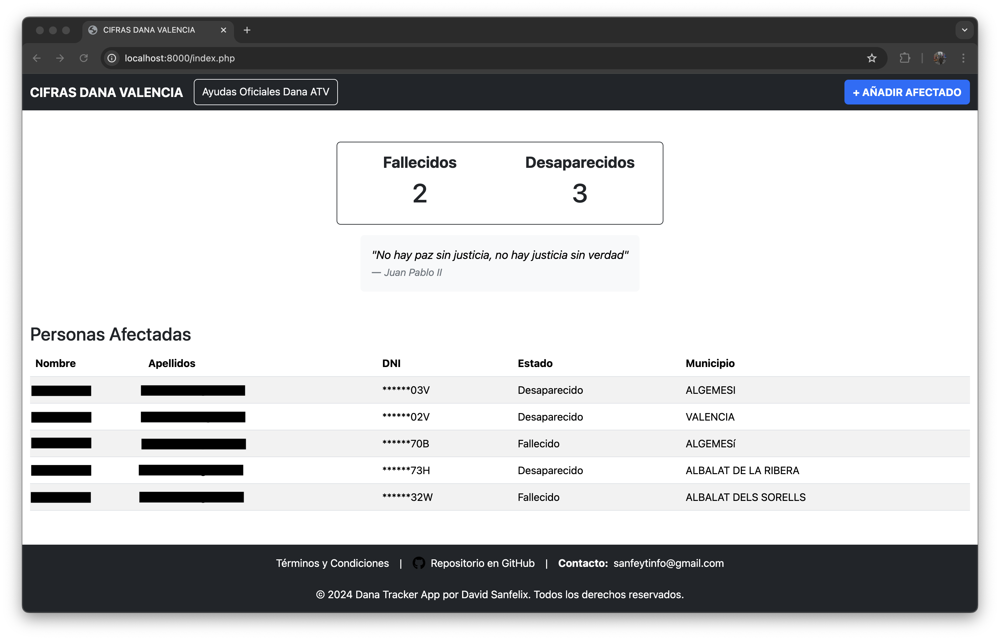
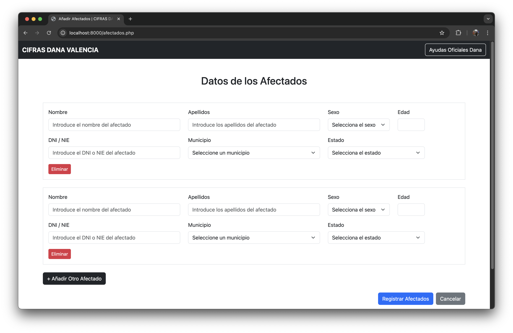

# Dana Tracker App
---
## Motivación 
Esta aplicación nace de la impotencia propia y colectiva del pueblo de Valencia ante la falta de verdad.

## Principal problema
El principal problema al que me he enfrentado al crear una aplicación así es evitar que los usuarios puedan introducir información falsa que desvirtue la mínima credibilidad que puede tener una página como esta. No busco que sea una fuente de verdad, pero si de orientación.

#### Medidas tomadas
Evitar que una persona añada afectados inventados no se si podría llegar a ser posible, pero poder evitar que alguien se haga pasar por otra persona si es conocedor de los datos personales solicitados si que sería posible gracias a la verificación SMS (que todavía está en proceso de añadirse).

Si alguien tiene ideas sobre como evitar la información falsa que no dude en comentarlo. Por mi parte he añadido Google Recaptcha, un comprobador de formato de DNI/NIE y la base de datos está estructurada de tal forma que cada afectado añadido va ligado a la persona que lo añadió, la cual tuvo que identificarse con anterioridad usando sus datos personales.

---
# Procedimiento de la página
La página web está compuesta de las siguientes páginas:

## Página principal
Página principal donde se muestra la cifra total de fallecidos y desaparecidos, la tabla correspondiente con los afectados, y dos botones: uno para redirigir al usuario a la página de las ayudas oficiales de la ATV, y un segundo botón con el que añadir afectados.



## Datos personales del usuario
Esta página se divide en dos partes: una primera donde el usuario es mostrado un modal donde se le explica el por qué de la introducción de sus datos personales, y una segunda para ingresarlos y poder continuar.


## Datos personales de los afectados
Esta es la úlima página, donde el usuario puede introducir los datos de los afectados, pudiendo añadir cuantos sean necesarios.



>[!NOTE]
> Se piden más datos de los mostrados en la tabla de la página principal por si fueran necesarios para algún estudio sobre la catástrofe por parte del gobierno o las instituciones pertinentes.

---
# Ejecutar la aplicación
## Requisitos
- Clonar el repositorio.
- Tener instalado `php`.
- Tener instalado `mysql`.

## Paso 1: Crear base de datos
Utilizando el archivo `create_db.sql`, poblar la base de datos ejecutando el comando:

```bash
mysql -u <username> -p < <path_to_repo>/dana-tracker-app/create_db.sql
```
- Reemplaza `<username>` con tu usuario MySQL y `<path_to_repo>` con la ruta donde hayas copiado el repositorio.

## Paso 2: Ejecutar servidor
Dentro de la carpeta del repositorio, ejecutar el siguiente comando:

```bash
php -S localhost:8000
```

---
# TODO
- [ ] Añadir verificación SMS para el login de usuarios
- [ ] Permitir modificar desaparecido a fallecido
- [ ] Hacer la página más responsive para dispositivos móviles
- [ ] Dockerizar la aplicación